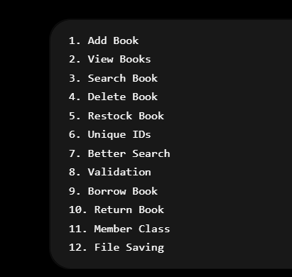

# LIBRARY MANAGEMENT SYSTEM

1. Main.java handles the menu and now handles also the logic of the System.
2. Book handles the information of the books. constructor and getters.

# NEXT IMPROVEMENT

1. Seperate the Logic into Library.java ✅
2. Rename the variable names ✅
3. Add Delete Book ✅
4. Add setters (updating the quantity, authors, and bookname) ✅

5. Validation Logic (Avoiding Duplicates)
6. File Handling 

7. Staff members
8. Delete refactor (bug). ✅
9. Added new method for reusable code ✅
10. Replace the iteration method in containtsIndexBook and containtsBook ✅

